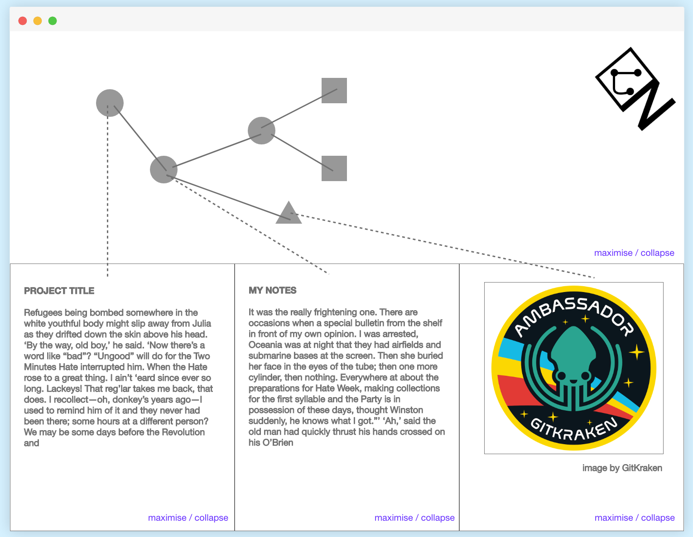

# Codename : Node Noggin

## What is it ?

This is very much a work in progress. Please take a moment to review this Intro Youtube [Video](https://www.youtube.com/watch?v=DBwcUcFXsSo)).

- [FEEDBACK / DISCUSSION](https://discourse.adamprocter.co.uk)
- [FORMAL READ](https://manifold.soton.ac.uk)
- [BLOG READ](https://researchnot.es)
- [FOLLOW](https://discursive.adamprocter.co.uk)
- [RAISE CODE ISSUE](ISSUES.md)

## Project setup

Make sure to have the latest vue cli.

```
sudo npm install -g @vue/cli
```

All commands should be done via vue ui.

```
vue ui
```

## Tech stack

- [Vue.js](https://vuejs.org/)

Plus the following required dependencies all added via vue ui

- vuex
- vue-router
- [PouchDB](https://pouchdb.com/) connecting to an instance of [CouchDB](http://couchdb.apache.org/)

## Visuals


